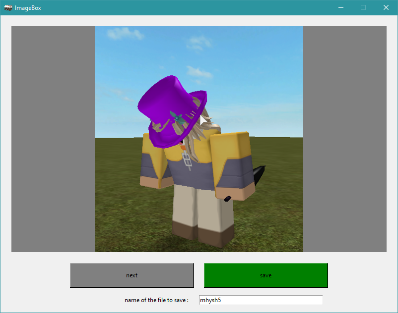

# ImageBox

ImageBox is a Python program wich scrap a screenshot hosting website to show you randoms screenshots and allow you to save theme.

## Installation

Use the package manager [pip](https://pip.pypa.io/en/stable/) to install all the requirements.

```bash
cd ImageBox
pip install -r requirements.txt 
```

## Usage

Simply execute the main file from the root folder (ImageBox)

```bash
python imageBox/main.py
```

## Preview


## Notes
- To prevent any problem run the programm whith [python 3.7.6](https://www.python.org/downloads/release/python-376/)
- Saved images are stored inside ImageBox/saved/

## License
[MIT](https://choosealicense.com/licenses/mit/)